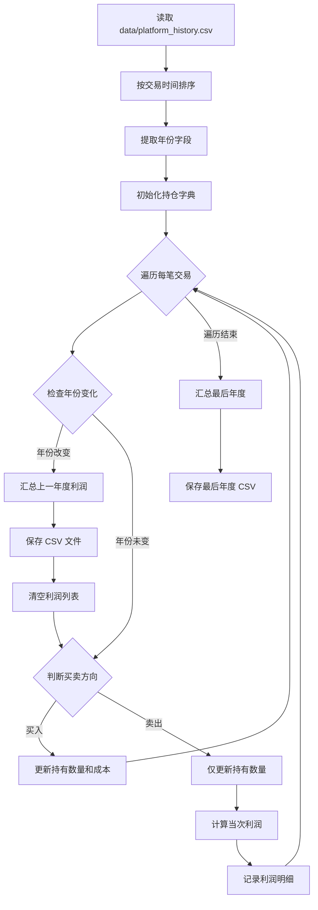
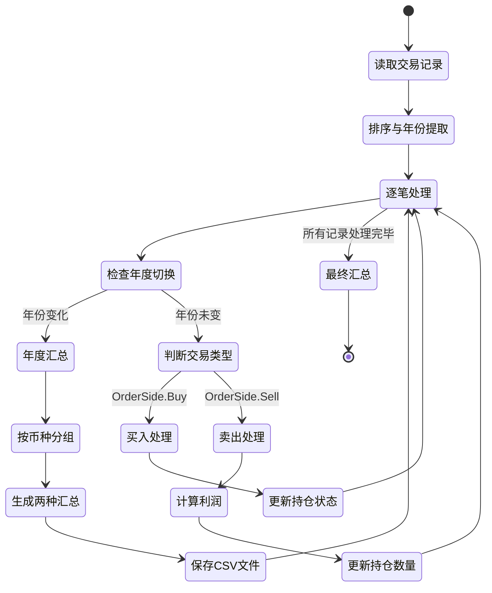

# 年度利润计算脚本设计文档

## 1. 设计目标

设计并实现 get_tax_moving_avg.py 脚本，用于基于移动加权平均法计算股票交易的年度利润。该脚本简化了现有 get_tax2.py 的逻辑，采用更清晰的成本核算方式：买入时更新持有数量和成本，卖出时仅更新持有数量并计算当次利润。

## 2. 核心业务逻辑

### 2.1 持仓状态管理

系统需要为每个股票代码维护持仓状态，包含以下要素：

| 状态字段 | 说明 | 初始值 |
|---------|------|--------|
| 持有数量 | 当前持仓数量 | 0.0 |
| 平均成本 | 每股的平均持仓成本(包含手续费) | 0.0 |

### 2.2 交易处理策略

#### 买入操作(Buy)

买入操作更新持仓数量和成本,遵循以下规则:

- 行为:增加持仓
- 数量更新:持有数量 = 原持有数量 + 买入数量
- 成本更新:采用加权平均法计算新的平均成本,手续费计入成本
  - 新平均成本 = (原持有数量 × 原平均成本 + 买入数量 × 买入价格 + 本次手续费) / 新持有数量

#### 卖出操作(Sell)

卖出操作仅更新持仓数量,并计算利润,遵循以下规则:

- 行为:减少持仓
- 计算卖出数量与持仓数量的关系:
  - 了结数量 = min(卖出数量, 持仓数量)
  - 计算了结总成本 = 了结数量 × 原平均成本
  - 计算利润 = 了结数量 × 卖出价格 - 了结总成本 - 本次交易对应比例的手续费
    - 对应比例手续费 = 本次手续费 × (了结数量 / 卖出数量)
  - 记录一笔利润记录
- 数量更新:持有数量 = 原持有数量 - 卖出数量
- 成本更新:平均成本保持不变

## 3. 年度利润汇总

### 3.1 年度切换逻辑

系统按年度处理交易记录：

- 数据预处理：按交易时间升序排序所有交易记录
- 年度识别：从交易时间中提取年份字段
- 切换触发：当检测到年份变化时，触发年度汇总
- 持仓延续：跨年度时，持仓状态保持延续，不清零

### 3.2 汇总计算方式

每个年度结束时，按结算币种分组进行两种汇总：

**汇总方式一：按年度计算**
- 计算范围：该年度所有了结交易的利润总和（包含正利润和负利润）
- 输出标识：股票代码字段标记为"按年度计算"

**汇总方式二：按单次计算**
- 计算范围：该年度所有盈利交易的利润总和（仅统计正利润）
- 输出标识：股票代码字段标记为"按单次计算"

### 3.3 利润记录结构

每笔利润记录包含以下字段：

| 字段名称 | 说明 | 示例值 |
|---------|------|--------|
| 配对原因 | 利润产生原因 | 平仓了结/年度汇总 |
| 股票代码 | 交易标的代码 | HK.01810 或 按年度计算 |
| 卖出价格 | 实际卖出价格 | 25.85 |
| 成本价 | 平均持仓成本价 | 27.3 |
| 数量 | 了结数量 | 1000.0 |
| 利润 | 本次交易利润 | -1450.0 |
| 时间 | 交易时间 | 2021-03-04 09:36:49 |
| 结算币种 | 交易币种 | HKD/USD |

## 4. 数据输入输出

### 4.1 输入数据格式

从 `data/{platform}_history.csv` 读取交易历史数据，必须包含以下列：

| 字段名称 | 数据类型 | 说明 |
|---------|---------|------|
| 股票代码 | 字符串 | 交易标的唯一标识 |
| 数量 | 浮点数 | 交易数量（正数） |
| 成交价格 | 浮点数 | 每股成交价格 |
| 买卖方向 | 字符串 | OrderSide.Buy 或 OrderSide.Sell |
| 结算币种 | 字符串 | HKD、USD 等 |
| 合计手续费 | 浮点数 | 本次交易总手续费 |
| 交易时间 | 日期时间 | 交易发生时间 |

### 4.2 输出数据格式

生成按年度和平台划分的利润明细文件：

- 文件路径：`data/{platform}_moving_avg_profit_{year}.csv`
- 文件编码：UTF-8 with BOM（utf-8-sig）
- 列字段：配对原因、股票代码、卖出价格、成本价、数量、利润、时间、结算币种

### 4.3 命令行参数

脚本支持通过命令行参数指定平台：

- 参数名称：platform
- 参数位置：第一个位置参数
- 默认值：futu
- 使用示例：`python get_tax_moving_avg.py longbridge`

## 5. 技术依赖与约束

### 5.1 运行环境

- Python 版本：3.7 及以上
- 核心依赖库：pandas
- 数据目录：脚本运行前自动检查并创建 data 目录

### 5.2 数据处理要求

- 时间排序：必须保持稳定排序（stable sort），确保同一秒内的交易顺序不变
- 数值精度：使用浮点数运算，保持 pandas 默认精度

### 5.3 输出格式约束

- 对齐要求：CSV 文件中数值字段保持一致的小数位数
- 时间格式：保持原始时间格式输出
- 中文支持：使用 UTF-8 with BOM 编码确保 Excel 正确显示中文

## 6. 与现有系统的集成

### 6.1 命名规范

遵循现有项目的文件命名规范：

- 脚本名称：get_tax_moving_avg.py
- 输出文件：`{platform}_moving_avg_profit_{year}.csv`
- 与现有 method1、method2 保持一致的结构

### 6.2 汇总报表支持

输出文件与 report.py 兼容：

- 保留"年度汇总"类型的配对原因字段
- 保留"按年度计算"和"按单次计算"两种汇总方式
- 确保 report.py 能够正确识别和统计新生成的利润文件

### 6.3 数据流图

### 6.4 核心处理流程

## 7. 核心算法说明

### 7.1 移动加权平均成本计算

买入时计算新的平均成本,手续费计入成本:

- 输入:原持有数量、原平均成本、买入数量、买入价格、本次手续费
- 计算公式:新平均成本 = (原持有数量 × 原平均成本 + 买入数量 × 买入价格 + 本次手续费) / (原持有数量 + 买入数量)
- 适用场景:加仓建仓

### 7.2 利润计算公式

卖出时计算交易利润,手续费从利润中扣除:

- 卖出收入 = 了结数量 × 卖出价格
- 持仓总成本 = 了结数量 × 平均成本(平均成本已包含买入时的手续费)
- 本次手续费 = 本次交易手续费 × (了结数量 / 卖出数量)
- 利润 = 卖出收入 - 持仓总成本 - 本次手续费

### 7.3 手续费处理策略

手续费处理遵循以下原则：

**买入时手续费处理**
- 手续费直接计入平均成本
- 后续持仓的平均成本已包含手续费成本
- 无需单独维护手续费状态

**卖出时手续费处理**
- 手续费按比例分摊:本次应承担手续费 = 本次交易总手续费 × (了结数量 / 卖出数量)
- 手续费从利润中扣除

## 8. 设计差异说明

与 get_tax2.py 相比，本设计的主要差异：

### 8.1 简化点

- 卖出操作不再更新平均成本（除非转换仓位方向）
- 利润计算时直接使用当前持仓的平均成本，无需重新计算
- 逻辑更符合直观的"先进先出"理解方式

### 8.2 保持一致

- 年度汇总方式完全一致
- 输出文件格式完全一致
- 跨年持仓延续机制一致
